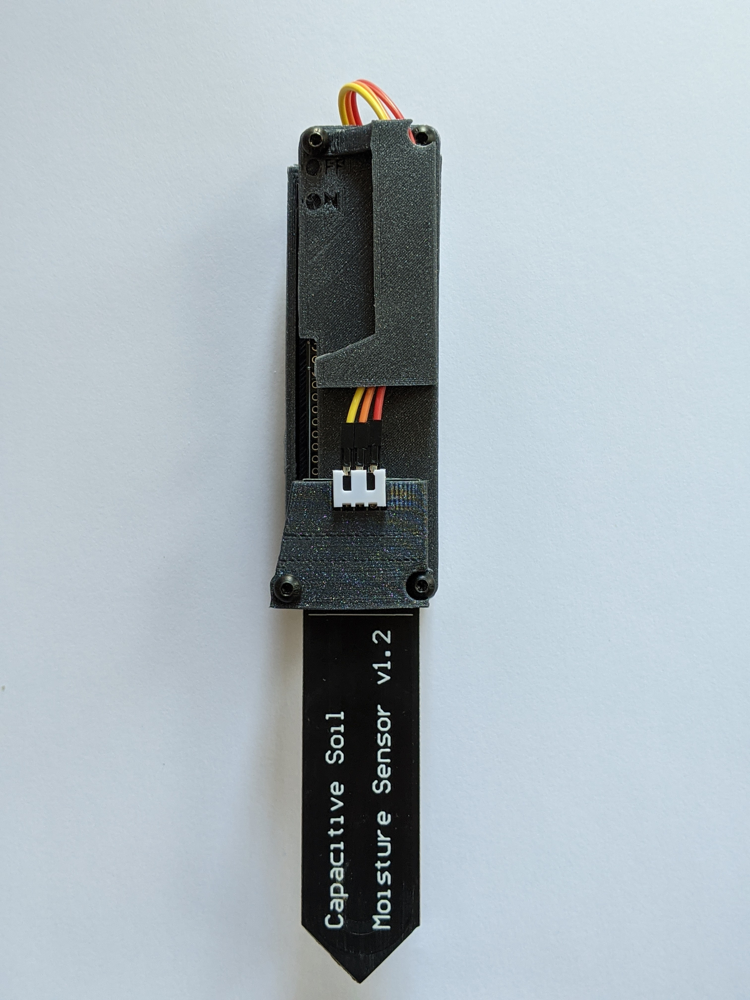
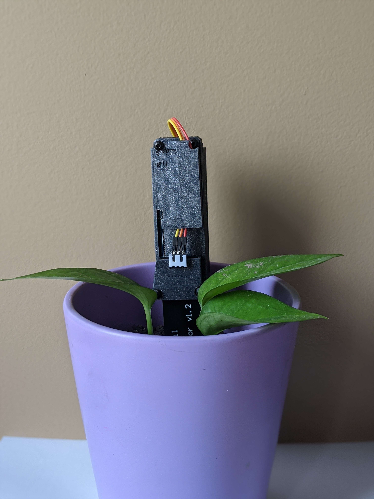
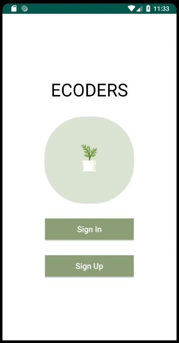
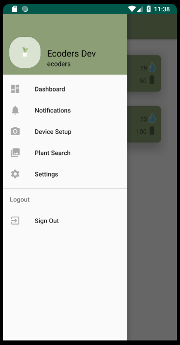
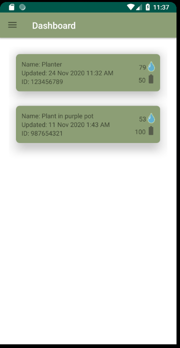
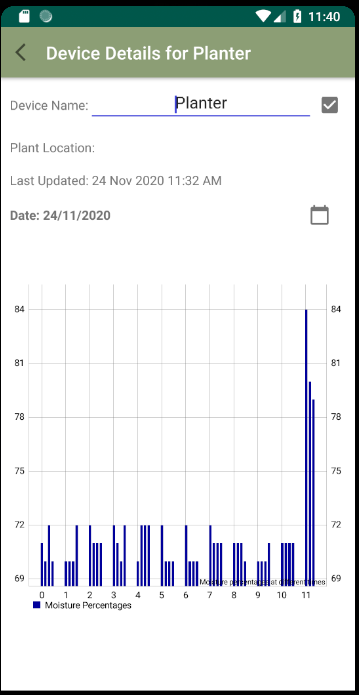
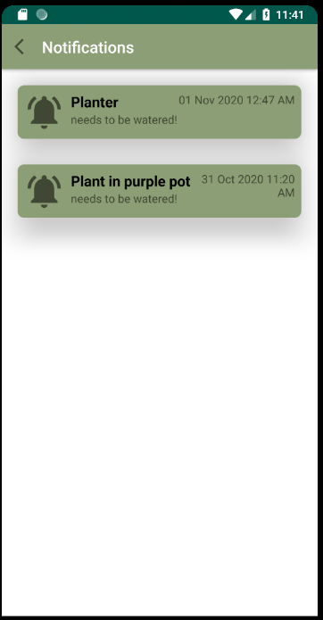
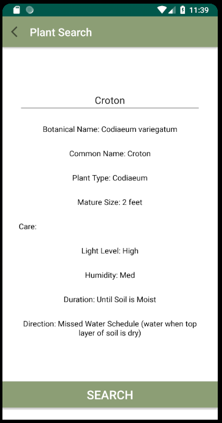
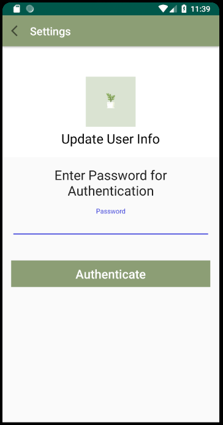
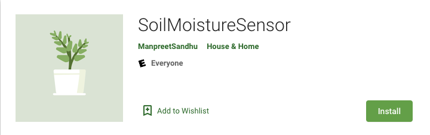

# Soil Moisture Sensor - Capstone Project 2020

Soil Moisture Sensor Application help to save your plant from dying or improper watering.

Our application works with a smart Soil Moisture Sensor hardware component that will be placed in the soil beside the plant to determine the moisture levels of the soil, which can be read by the user in an app associated with the device. Our easy-to-use application will allow for a stress-free reminder to water your plants all while providing additional information about the correct care.

## Soil Moisture Sensor Hardware Component

## Soil Moisture Sensor Application

1. HomePage

2. NavigationBar: Shows all the options available to the user. 

  
3. Dashboard: Shows the device (<i> Soil Moisture Sensor Hardware Component </i>) added to the application by user with details such as <b> Device Name, Soil Moisture level, and battery info etc.</b>.

4. DeviceDetail Page: Shows the details of device with a bar chart and user can also have the privelege to update the device name.

5. Notification Page: All the notifications regarding if plants needs water or soil moiture level is low in the plant that will appear on this page.

6. DeviceSetup Page: Gives user step by step instructions to setup a device (<i> Soil Moisture Sensor Hardware Component </i>).

7. PlantSearch Page: User can search the crucial detail about the plant on this page. 

8. Settings Page: User can update it's personal information but first, user needs to authenticate to update any information.

## MongoDB Database used for the data storage.

 

## Available on Google Play Store: SoilMoistureSensor

<h3><a href = "https://play.google.com/store/apps/details?id=com.soilmoisturesensor" style="text-align:center;"> Click here to download</a><h3>

